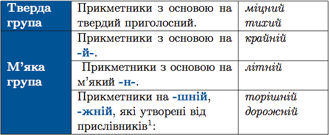

#Вiдмiнювання прикметникiв

Вiдмiнковi закiнчення прикметникiв залежать вiд групи, до якої цi прикметники належать.

 

ЗНО

Потрiбно розрiзняти паронiмiчнi прикметники. Наприклад: <i>дружна родина – дружнiй погляд</i>. Перший з них належить до твердої групи, а другий – до м’якої.

