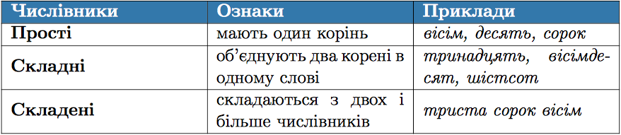

#Розряди числiвникiв за будовою

 

<quiz> 
    <question>
       
Складений числівник є у варіанті:

           <answer correct>вісімсот сорок один</answer>
           <answer>тридцять</answer>
           <answer>шістнадцять</answer>
           <answer>десять</answer>
      <explanation>
Вісімсот сорок один – складений числівник; тридцять, шістнадцять – складні; десять – простий.
</explanation>
    </question>
</quiz> 
