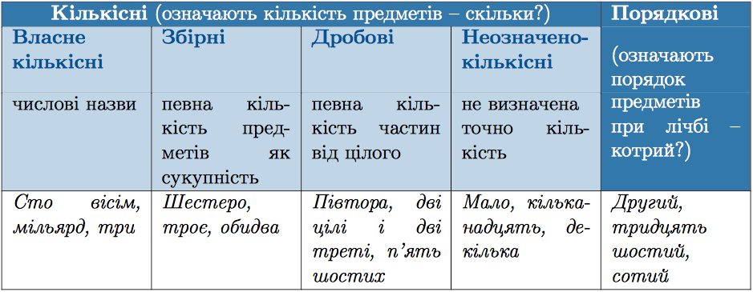

#Розряди числiвникiв за значенням i граматичними ознаками

 

Кiлькiснi числiвники за вiдмiнками змiнюються, але не мають граматичних ознак числа i роду, крiм числiвника один (одна, одне, однi). 
 
Порядковi числiвники змiнюються за родами, числами i вiдмiнка- ми, як прикметники.