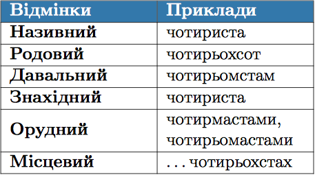
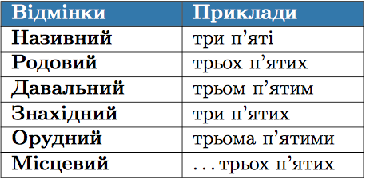
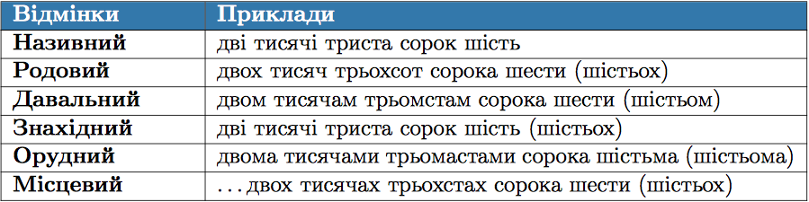

#Вiдмiнювання кiлькiсних числiвникiв

<b>&rarr;</b> Числiвник один змiнюється за числами, родами та вiдмiнками. 

 

<b>&rarr;</b> Числiвники два, три, чотири мають однаковi закiнчення у непрямих вiдмiнках (крiм знахiдного та орудного), як i збiрнi числiвники обидва, обидвi, обоє, багато, кiлька.

 

ЗНО

В орудному вiдмiнку числiвники <b>чотири</b> та <b>багато</b> мають закiнчення –ма : <i>чотирма, багатьма</i>.

 

<b>&rarr;</b> Числiвники вiд п’яти до десяти та числiвники на -дцять i -десять вiдмiнюються за такими зразками:

 

<b>&rarr;</b> У складних числiвниках п’ятдесят-вiсiмдесят, кiлькадесят вiдмiнюється тiльки друга частина.

 

<b>&rarr;</b> Числiвники сорок, дев’яносто, сто мають закiнчення -а в усiх вiдмiнках, крiм називного та знахiдного.

 

 

<b>&rarr;</b> У складних числiвниках двiстi-дев’ятсот, кiлькасот вiдмiнюються обидвi частини.

 

 

<b>&rarr;</b> Числiвники тисяча, мiльйон, мiльярд, нуль вiдмiнюються як iменники.

<b>&rarr;</b> Збiрнi числiвники вiдмiнюються як власне кiлькiснi.

<b>&rarr;</b> Дробовi числiвники вiдмiнюються так: чисельник — як кiлькiсний числiвник, а знаменник – як порядковий.

 

<b>&rarr;</b> Числiвники пiвтора, пiвтори, пiвтораста не вiдмiнюються.

<b>&rarr;</b> У складених кiлькiсних числiвниках вiдмiнюються всi складовi частини.

 

<quiz> 
    <question>
       
Правильною є відмінкова форма числівника

           <answer>Називний відмінок – ста</answer>
           <answer>Родовий відмінок – сорокох</answer>
           <answer>Давальний відмінок – дев’яностам</answer>
           <answer correct>Орудний відмінок – ста</answer>
      <explanation>
Числівники сорок, дев’яносто, сто мають закінчення –а в усіх відмінках, крім називного та знахідного.
</explanation>
    </question>
</quiz> 

<quiz> 
    <question>
       
Допущено помилку у відмінюванні числівника:

           <answer correct>п'ятидесяти восьми</answer>
           <answer>вісімнадцятьох</answer>
           <answer>триста дві</answer>
           <answer>сорока шести</answer>
      <explanation>
П’ятидесяти восьми – п’ятдесяти восьми. У складних числівниках п’ятдесят-вісімдесят, кількадесят відмінюється тільки друга частина.</explanation>
    </question>
</quiz> 

#Вiдмiнювання порядкових числiвникiв

У складених порядкових числiвниках вiдмiнюється лише останнiй компонент.

 