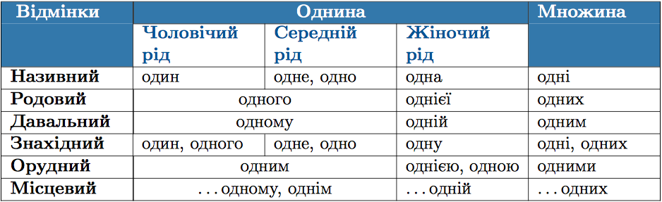
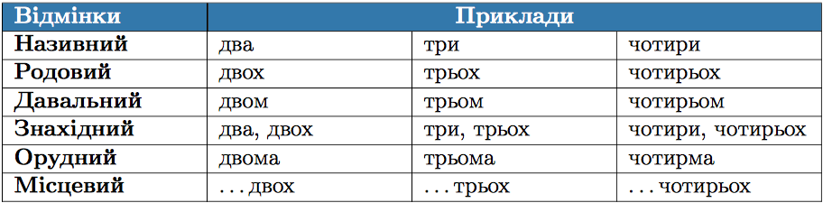
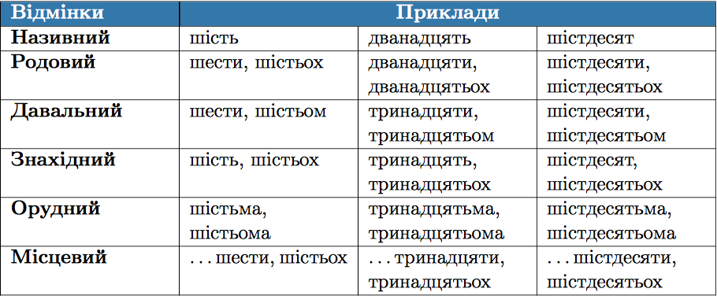
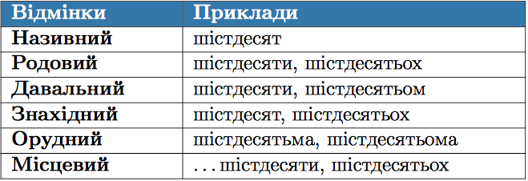
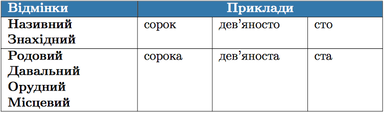

#Вiдмiнювання кiлькiсних числiвникiв

<b>&rarr;</b> Числiвник один змiнюється за числами, родами та вiдмiнками. 

 

<b>&rarr;</b> Числiвники два, три, чотири мають однаковi закiнчення у непрямих вiдмiнках (крiм знахiдного та орудного), як i збiрнi числiвники обидва, обидвi, обоє, багато, кiлька.

 

ЗНО

В орудному вiдмiнку числiвники <b>чотири</b> та <b>багато</b> мають закiнчення –ма : <i>чотирма, багатьма</i>.

  

<b>&rarr;</b> Числiвники вiд п’яти до десяти та числiвники на -дцять i -десять вiдмiнюються за такими зразками:

 

<b>&rarr;</b> Ускладних числiвниках п’ятдесят-вiсiмдесят, кiлькадесят вiдмiнюється тiльки друга частина.

 

<b>&rarr;</b> Числiвники сорок, дев’яносто, сто мають закiнчення -а в усiх вiдмiнках, крiм називного та знахiдного.

 

 

<b>&rarr;</b> У складних числiвниках двiстi-дев’ятсот, кiлькасот вiдмiню-
ються обидвi частини.

 

 