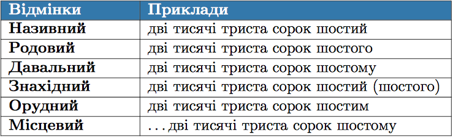

  <h2 class="course">Онлайн-курс «Українська мова. Від фонетики до морфології»</h2>
  

     У цьому курсі ми розглянемо основні розділи мовознавства, які необхідно знати для успішного складання ЗНО та подальшого засвоєння матеріалу. 
  

    

        <a class="registration-button" target="_blank" href="http://bit.ly/2zuYUGS">Зареєструватися</a>
    
   

# Вiдмiнювання порядкових числiвникiв

У складених порядкових числiвниках вiдмiнюється лише останнiй компонент.

 