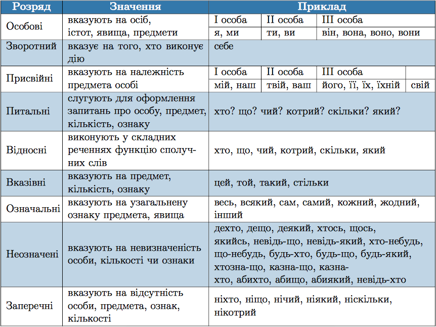

#Розряди займенникiв за значенням

 

<quiz> 
    <question>
       
Усі займенники є особовими в рядку:

           <answer>я, його, вами</answer>
           <answer>нам, вони, твій</answer>
           <answer correct>вами, у них, тебе</answer>
           <answer>він, його, свій</answer>
      <explanation>
Ви – вами, вони – у них, ти – тебе (особові).
Його, твій, свій – присвійні.
</explanation>
    </question>
</quiz> 
  
  

<quiz> 
    <question>
       
Усі займенники заперечні у рядку:

           <answer correct>ніщо, нічий, ніскільки</answer>
           <answer>весь, сам, жодний</answer>
           <answer>котрийсь, скільки-небудь, дехто</answer>
           <answer>такий, стільки, той</answer>
      <explanation>
Ніщо, нічий, ніскільки – заперечні.
Весь, сам, жодний – означальні.
Котрийсь, скільки-небудь, дехто – неозначені.
Такий, стільки, той – вказівні.</explanation>
    </question>
</quiz> 

<quiz> 
    <question>
       
Присвійний займенник є в кожному рядку, ОКРІМ:

           <answer>брати її речі</answer>
           <answer>наша співпраця триває</answer>
           <answer>ваше ставлення до роботи</answer>
           <answer correct>запросити його у ресторан</answer>
      <explanation>
Запросити його у ресторан – особовий займенник він у формі знахідного відмінка (кого?).
</explanation>
    </question>
</quiz> 
