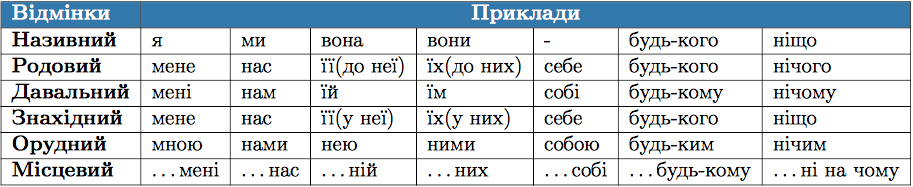

#Вiдмiнювання займенникiв

Особливостi вiдмiнювання займенникiв залежать вiд того, з якою частиною мови вони спiввiдноснi.

<b>&rarr;</b> <b>Займенники, спiввiдноснi з iменниками</b>

З iменниками спiввiдноснi особовi займенники, зворотний, а також питальнi, вiдноснi, заперечнi та неозначенi з основами хто, що.

 

<b>&rarr;</b> <b>Займенники, спiввiдноснi з прикметниками</b>

Зi займенниками спiввiдноснi присвiйнi (мiй, твiй, наш, ваш, свiй, їхнiй), вказiвнi (цей, той, такий), означальнi (сам, самий, всякий, кожний, жодний, iнший), питальнi i вiдноснi (який, чий, котрий), а також неозначенi та заперечнi з основами який, чий, котрий.