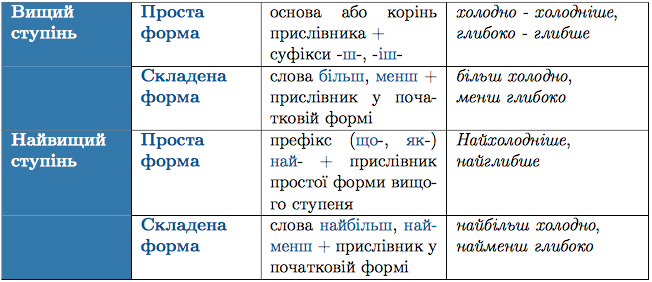

#Ступенi порiвняння прислiвникiв

Ступенi порiвняння утворюють тiльки якiсно-означальнi прислiвники на -о, -е, якi походять вiд якiсних прикметникiв. Форми утворюються, як i в прикметникiв. Вiдбуваються тi самi змiни.




 



ЗНО

Помилкою є утворення ступенiв порiвняння прислiвникiв за допомогою додавання слiв бiльш, менш, найбiльш, найменш до простої форми вищого ступеня.
Наприклад: <i><s>бiльш холоднiше</s> – бiльш холодно, <s>найменш глибше</s> - найменш глибоко.</i>

 

Основа прислiвника може зазнавати змiн за творення простої форми вищого ступеня порiвняння з суфiксом -ш-:
<ul>
<li>Суфiкси -к-, -ок-, -ен- випадають: <i>широко – ширше</i></li>
<li> г, ж, з + ш = жч: <i>вузько–вужче;</i></li>
<li> с + ш = щ(шч): <i>високо–вище</i>. Винятки: <i>легко – легше, довго – довше.</i></li>
</ul>
